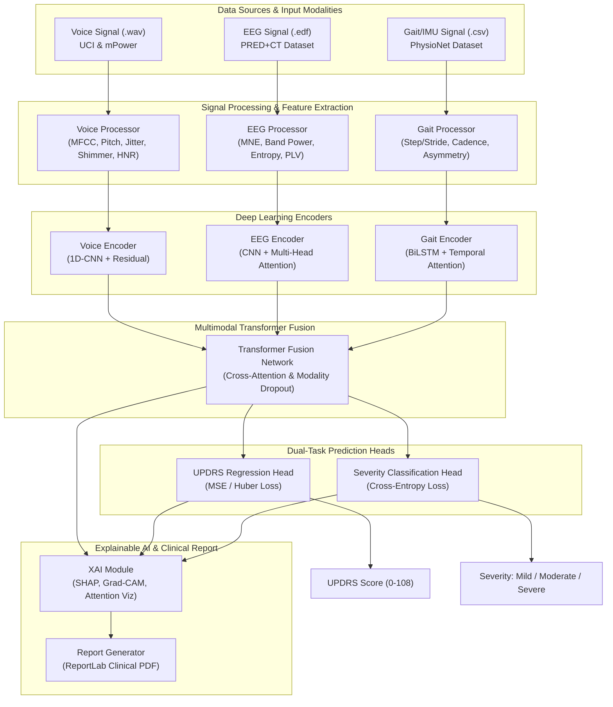
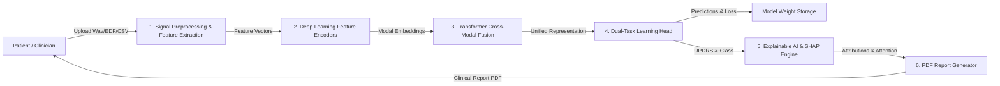
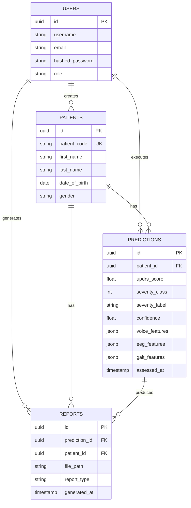
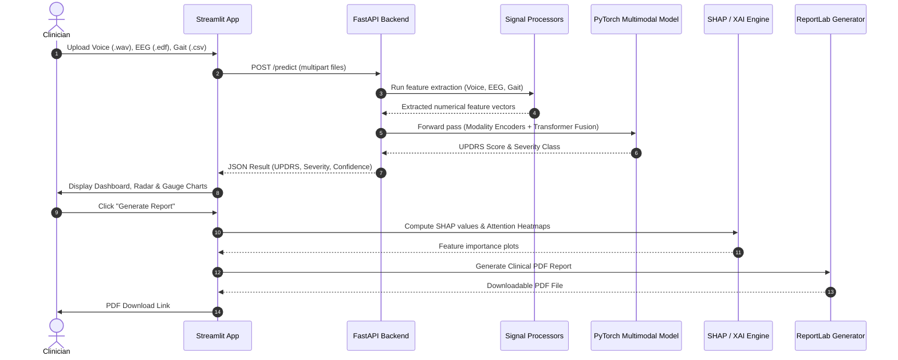
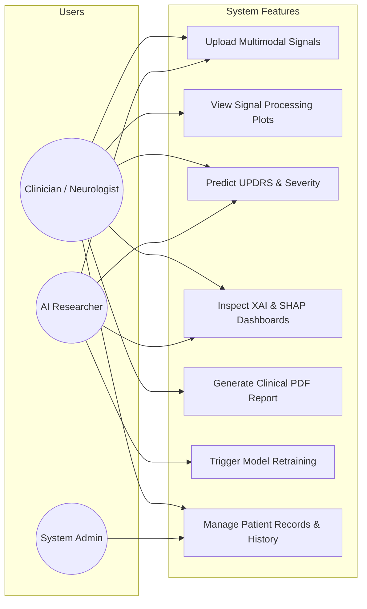

# IEEE Paper Diagrams (Mermaid Code)

## 1. System Architecture Diagram

## 2. Data Flow Diagram (DFD Level 1)

## 3. Entity-Relationship (ER) Diagram

## 4. Sequence Diagram

## 5. Use Case Diagram

